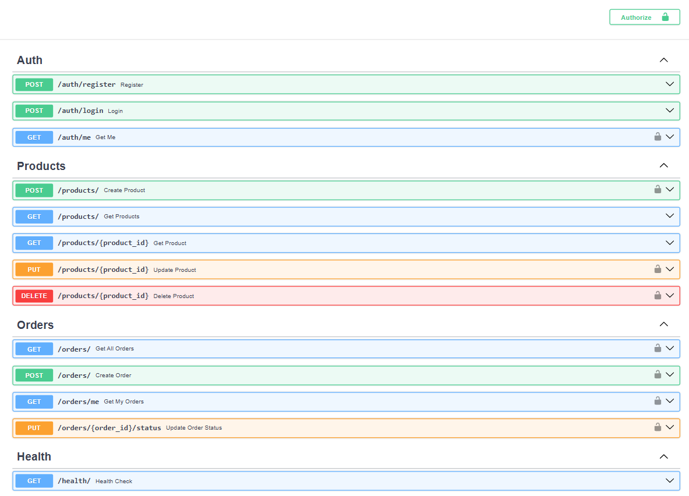

# E-Commerce API (FastAPI)

A production-ready E-Commerce REST API built with FastAPI, PostgreSQL, Redis and React.

This project demonstrates secure authentication, role-based access control, caching strategies, transactional order handling, background processing, and containerized deployment.

---

## Overview

This API implements a clean backend architecture for an e-commerce platform.

It focuses on correctness, performance, and production-style patterns such as:

1. Stateless authentication  
2. Cache-aside pattern  
3. Transaction rollback  
4. Distributed rate limiting  
5. Environment-based configuration  
6. Containerized services  

---

## Features

### Authentication & Security

- JWT-based authentication  
- Role-based access control (Admin / Customer)  
- Password hashing with bcrypt  
- Redis-backed rate limiting  
- Protected endpoints  

---

### Product Management

- Create, Read, Update, Delete operations  
- Pagination  
- Filtering  
- Sorting  
- Search endpoint  
- Redis caching (TTL-based)  
- Cache invalidation on write operations  

---

### Order Management

- Multi-item order creation  
- Automatic stock deduction  
- Transaction rollback support  
- Admin order status updates  
- Background email confirmation task  

---

### Infrastructure

- PostgreSQL as primary database  
- Redis for caching and rate limiting  
- Centralized logging  
- Health check endpoint  
- Dockerized deployment  
- Environment-based configuration  

---

## Tech Stack

### Backend
- FastAPI  
- SQLAlchemy  
- PostgreSQL  
- Redis  
- Docker & Docker Compose  
- python-jose (JWT)  
- Passlib (bcrypt)  
- SlowAPI (rate limiting)  
- Pydantic

### Frontend
- React

### DevOps
- Docker & Docker Compose   

---

## Running with Docker

### 1. Create a `.env` file

```env
DATABASE_URL=postgresql://postgres:password@db:5432/ecommerce
REDIS_URL=redis://redis:6379
SECRET_KEY=your_secret_key
```

### 2. Build and start services

```bash
docker compose up --build
```

### 3. Access API documentation

```
http://localhost:8000/docs
```

### Swagger Preview

```

```

---

## Health Check

**Endpoint:**

```
GET /api/v1/health
```

---

## Future Improvements

- Database migrations with Alembic  
- Refresh token implementation  
- Structured production logging  
- CI/CD integration

---

## Scalability

- Stateless JWT authentication enables horizontal scaling  
- Redis used for caching and distributed rate limiting
- Order creation wrapped in database transactions for consistency  
- Dockerized services support container orchestration


